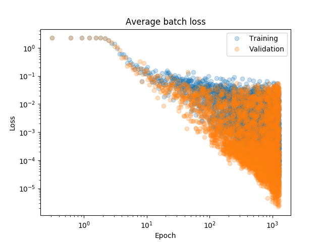
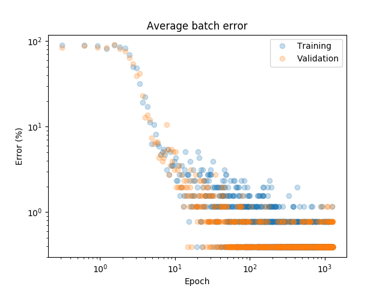
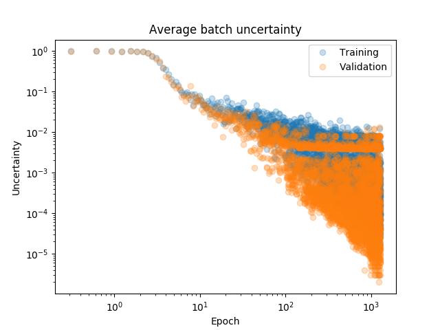

# MNIST Digit Recognizer

Standard introductory competition to identify handwritten digits from the MNIST dataset. The architecture of the neural network used to classify the images was a 15-layer CNN constructed using Inception blocks and residual skip-connections, which is explained in the [architecture log](./DigitRecognizerArchitecture.log). To prevent overfitting, a large variety of techniques were employed to regularize the network, including additive input and weight noise, dropout, batch normalization, L2 weight decay, and random cropping. This combination of regularizing techniques was especially effective, as the metrics used to monitor progress during training show that the loss, error, and uncertainty (defined as 1 minus the probability assigned to the correct class) of the validation set performance (where the regularizers such as dropout and noise are turned off) consistently outperform the training set metrics.

One note about the "uncertainty" metric: as you can see from the above plots, the error stops being useful after a while because of quantization of the error value due to the finite size of the training/validation batches, leading to a dense line with error = 1/BATCH_SIZE. The uncertainty gets around this limitation by taking into account the actual probability assigned by the network to each prediction. Since the probability is a real number (not just a 1 or 0 for a right/wrong answer), you can continue to see improvement even when the the network starts to get the right answer 100% of the time.

In the end, the classifier was able to score .99585 accuracy on the test set (which corresponds to 116/28000 misclassified images), which is within the top 250 on Kaggle, and amongst the [state-of-the-art results reported in the literature](http://rodrigob.github.io/are_we_there_yet/build/classification_datasets_results.html#4d4e495354).
