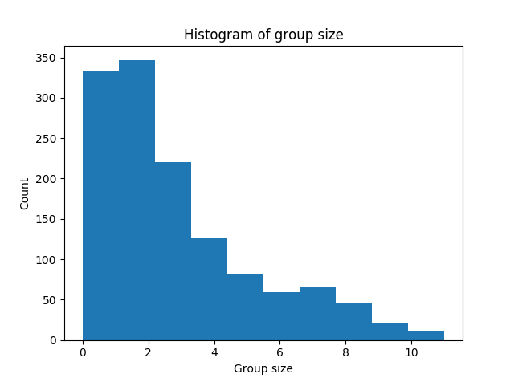

# Titanic Survival Prediction

Introductory machine learning competition: predict who would survive the sinking of the Titanic based on some data (age, sex, name, ticket number, family members, etc).

## Data cleaning
The first thing that we need to do is take a look at our data. The provided data is organized into several columns: PassengerId, Survived, Pclass (economic class), Name, Sex, Age, SibSp (# of siblings/spouses), Parch (# of parents/children), Ticket, Fare, Cabin, and Embarked. In the combined training/test sets provided, there are a number of missing values:
- 263 in the Age column
- 1014 in the Cabin column
- 2 in the Embarked column
- 1 in the Fare column
The missing age values can probably be imputated fairly easily by just using the average age of each person's title (more on that later). The missing Cabin values are probably unable to be recovered because they are too numerous. The two missing in Embarked can be imputated by noticing that people with similar ticket numbers embarked from Southampton, so they're likely to be from there too. The single missing Fare value can be imputated by replacing it with an average over passengers with the same Pclass/Embarked values.

## Feature engineering
The following will be the features used for prediction. Unless otherwise specified, all features are normalized to zero mean and unit variance.

### Pclass
This is already provided as an integer (1,2,3) denoting socio-economic class, with 1 being lowest, 3 the highest. I'll leave this as-is.

### Titles
The Name column is provided as a string containing the last name, title, and first name of the passenger (e.g. "Ostby, Mr. Engelhart Cornelius"). Since family groups are likely a strong indicator of survival, we will extract the last name of each passenger and use it for later to determine group structure. Likewise, the titles can be useful too, such as for imputating the age of passengers with missing data. I won't use this as a feature itself, but it can be used for other stuff.

### Sex
The sex of the passenger is a strong indicator of survival, as most of the survivors were women. I'll turn this into a binary feature mapping (male,female) to (0,1).

### Age
This column can mostly be left as-is (except for rescaling after imputation). We can fill the missing values by looking at the title of the passenger with missing data, and then replacing it with the average age over passengers with similar titles. (For example, 'Ms.' -> 28.0, 'Mrs.' -> 37.0, 'Master.' -> 5.5.)

### Adjacency matrix
This feature is an attempt to guess at the strength of relations between passengers. The sum of the SibSp and Parch columns provides a decent measure of family groups, but there are other groups as well who have no familial relation. A good example is the following group:

PassengerId	Survived	Pclass	Name			Sex		Age	SibSp	Parch	Ticket	Fare	Cabin	Embarked

75			1			3		Bing, Mr. Lee	male	32	0		0		1601	56.4958			S

839			1			3		Chip, Mr. Chang	male	32	0		0		1601	56.4958			S

644			1			3		Foo, Mr. Choong	male		0		0		1601	56.4958			S

693			1			3		Lam, Mr. Ali	male		0		0		1601	56.4958			S

827			0			3		Lam, Mr. Len	male		0		0		1601	56.4958			S

510			1			3		Lang, Mr. Fang	male	26	0		0		1601	56.4958			S

170			0			3		Ling, Mr. Lee	male	28	0		0		1601	56.4958			S

These gentlemen clearly are travelling together, since they have the same ticket number, fare, embarkation point, pclass, and all appear of Asian origin (while the rest of the ship's passengers are mostly European/Caucasian). Therefore, another metric of group size could be the number of passengers which share a ticket number. We can also immediately rule out connections between passengers who have different embarkation points, had cabins in different decks, etc.
We can determine the group structure by constructing an approximate adjacency matrix, A = tanh(S), where the elements S_ij correspond to a linear combination of factors determining the strength of the relationship between passengers i and j, such as those mentioned above. A value of -1 means the passengers surely aren't in the same group, while +1 means they surely ARE in the same group. The adjacency matrix itself is too large to be useful as a feature (since it has as many columns as there are passengers), but we can use it to figure other stuff out.

### Group size
With the adjacency matrix, we can get an idea of the sizes of groups by simply summing over the elements of A which have a value over some threshold (say 0.5) for each passenger (i.e. group_size = np.sum(A > 0.5, axis=1)). That gives something like the following:

You can see that most people are travelling in small groups of 2-3 people or by themselves. This will be a useful feature.

### Couples
We can also use this information to identify likely couples. If you scroll through the dataset, you can find a lot of cases where male-female pairs share ticket numbers and the female survives while the male doesn't (yay for chivalry), so this is likely a good feature. We can build this feature by iterating through the passenger list, and finding groups of two composed of one male and one female.

## Prediction
In order to predict the survival of the passengers, we should treat this as a single-class classification problem. The classifier used is an ensemble using majority voting composed of several SVM's (with rbf, linear, 2nd and 3rd degree polynomial kernels), and a pair of shallow neural networks (one with a single hidden layer with 100 neurons, and one with two hidden layers of 20 neurons each). Hyperparameters (C and gamma for the SVM, and the learning rate and alpha for the MLP) were chosen using random search. Using k-fold cross-validation (with k=10), the validation accuracy for each individual classifier is consistently about 0.78-0.82. Unfortunately, the ensemble predictions on the public portion of the kaggle test set only give me accuracies of about 0.76-0.78. I managed to get to 0.80 on the test set at one point, which put me in the top 12% (hey, not bad, especially considering most of the people at the top of the leaderboard are cheating). One large outstanding question I have is "why is performance on the test set so much worse than what you would expect from the validation set"? Apparently, other competitors have noticed this too. The only explanation I've found that seems to make sense is that the portion of the test set that is evaluated publicly is incomplete, and one would expect your test accuracy to be closer to that of the validation accuracy once the predictions on the rest of the test set are taken into account.